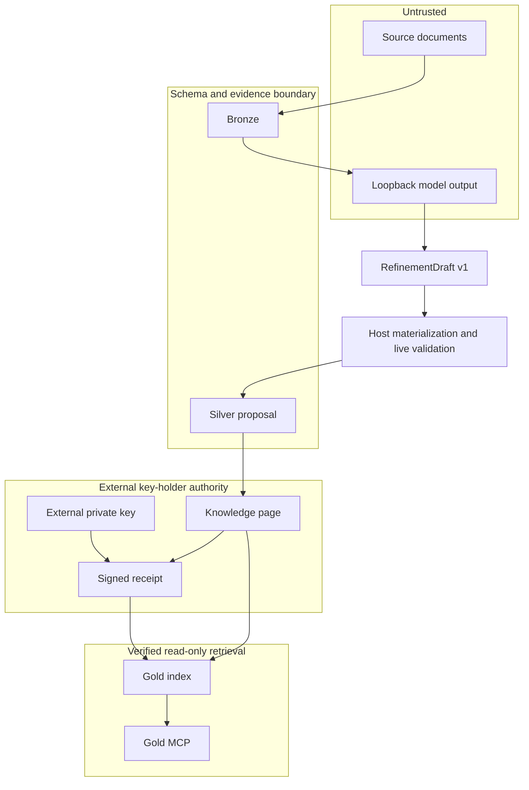

# Ziggurat Architecture

## System purpose

Ziggurat is a memory admission firewall. It preserves untrusted source material,
allows models to stage evidence-backed candidates, and requires a separately
verifiable human capability before content becomes durable Gold context.

## Assets

| Asset | Location | Security role |
|---|---|---|
| Inbox source | `inbox/` | Untrusted capture input |
| Bronze record | `bronze/` | No-overwrite, hash-verified evidence |
| Silver proposal | `.ziggurat/proposals/` | Complete but non-authoritative model candidate |
| Knowledge page | `knowledge/` | Human-authored curated content |
| Trust policy | `config/trust.yaml` | Reviewer public-key trust anchors |
| Authorization receipt | `authorizations/` | Detached signed admission decision |
| Gold index | `.ziggurat/gold-index.json` | Authorized Gold retrieval |
| Review index | `.ziggurat/review-index.json` | Policy-safe Silver plus Gold |
| Evidence index | `.ziggurat/evidence-index.json` | Policy-safe Bronze plus Gold |

## Actors and capabilities

| Actor or process | Read | Write | Cannot do |
|---|---|---|---|
| Untrusted source | none | Inbox input | Authorize persistence |
| `ingest` | Real regular files under `inbox/`, Bronze hashes | New no-overwrite Bronze | Read or delete anything outside the real `inbox/` directory |
| Loopback refine model | A bounded host-built reference block of Bronze bytes and optional target context | Strict `RefinementDraft` v1 response only | Access filesystem or tools through Ziggurat, invent available sources, or supply canonical hashes |
| `refine` host pathway | Selected Bronze, explicit target base | One materialized, validated Silver v2 proposal | Write Bronze, knowledge, receipts, trust, reviewed metadata, or indexes |
| Human reviewer | Bronze, Silver, knowledge | Manual page and external signed receipt | A signature does not grant factual certainty |
| `build` | Corpus, receipts, public keys | Generated indexes | Admit a page without valid authorization |
| General AI client | Gold citations | none | Select review/evidence through shipped MCP |
| Advisory curator/reviewer tooling | Operator-granted read-only files or review/evidence data | none | Assert human identity or authorize Gold |
| Trusted operator | Entire local vault | Filesystem and process configuration | Use Ziggurat to constrain operator-level filesystem access |

The decisive capability is possession of a trusted Ed25519 private key outside the
vault. Public metadata such as `reviewed_by` is not a capability.

The advisory Curator agent's declared read tools are distinct from the loopback model
interface. The latter receives serialized reference data only, with no file handles,
tools, or signing capability. An operator granting a separate agent filesystem access
has made a separate delegation.

## Trust boundaries

AI is allowed to read across the output side of the human boundary. It is not
allowed to exercise the admission capability.

## State transitions

1. `inbox/*.md` -> `bronze/<kind>/<date>-<slug>.md`
2. Bronze evidence and optional explicit target -> host-built bounded reference context ->
   model `RefinementDraft` v1 -> host materialization and live staging validation ->
   `.ziggurat/proposals/<proposal-id>.json` (Silver v2)
3. Silver proposal -> manual `knowledge/*.md` plus detached receipt
4. Authorized page -> Gold chunk during `build`
5. Gold chunk -> citation-scoped, read-only Gold result

Step 2 is the only place model output crosses into stored state, and it crosses
through a strict draft schema, host materialization, the strict stored proposal schema,
and the evidence validator. Draft evidence names only host-supplied source IDs and
1-based line ranges. The host derives exact quotes and hashes, candidate sources,
candidate confidence and schema version, and the base-content hash from a host-read
target. It revalidates the materialized proposal against live files before staging.
The model never holds a path it can dereference; paths in context are data, not handles.

`refine --target knowledge/item.md` supplies the existing page context required for
`amend` and `contradict`. `--source` explicitly authorizes disclosure of selected Bronze
even when the default model-access privacy filter would exclude it. Only bytes actually
supplied in the bounded reference block enter the source-ID mapping; omitted sources
cannot be cited.

There is no automated Silver-to-knowledge transition and no promote command.
Contradiction proposals are no-overwrite artifacts. A reviewer resolves one by listing its ID
in the page and signing that exact page.

## Enforcement points

| Enforcement point | Control |
|---|---|
| Inbox boundary | Real-path resolution to a regular file under `inbox/`; symlink, reparse, hard-link, traversal, and escape refusal before any read or delete |
| Bronze store | Atomic no-overwrite write and body SHA-256 |
| Refine reference builder | Host-selected sources, hash-verified, bounded per record and in total, omitted rather than truncated, labeled non-instructional |
| Adapter transport | Loopback-only llama.cpp chat completions, non-streaming JSON Schema response, no redirects, 30 second deadline, 1 MiB request/response ceilings |
| Model draft contract | Strict `RefinementDraft` v1, no hashes, quotes, source paths, or admission fields in evidence |
| Host materializer | Resolves supplied source IDs and line ranges, derives canonical citations and target base hash, then invokes live staging validation |
| Proposal contract | Stored strict v2 schema remains unchanged and excludes admission fields |
| Evidence validator | Exact Bronze path, body hash, line range, quote, and quote hash |
| Proposal store | Atomic, root-constrained write; strict fail-closed reads |
| Corpus collector | Unreadable, unparsable, or schema-invalid entries rejected and reported by path without content |
| Page canonicalizer | Stable semantic JSON and LF-normalized body |
| Receipt verifier | Trusted Ed25519 key, strict schema, exact page/path/identity/time binding |
| Gold eligibility | Status, retrieval, privacy, sensitivity, egress, age, lineage, contradiction, authorization |
| Profile builders | Physical separation and policy-safe source selection |
| Index verifier | Chunk labels, content, provenance, BM25, trust policy, and live corpus |
| MCP server | Gold-only startup, two read-only tools, strict tool inputs, bounded query, result, and session citation counts |
| Clean-room audit | Present-but-invalid configuration fails the audit instead of defaulting |

The adapter accepts one finished assistant text response at
`choices[0].message.content`. It does not repair JSON, retry, fall back to another
protocol, or accept tool calls. CLI JSON-mode failures go to stderr as
`{"error":{"code":"...","message":"..."}}`. The
[local model protocol](docs/local-model-protocol.md) specifies the request, draft
contract, pinned setup candidate, and opt-in real-model evaluation gate.

## Physical index isolation

| Index | Contents |
|---|---|
| gold | Authorized Gold only |
| review | Policy-safe Silver plus Gold |
| evidence | Policy-safe Bronze plus Gold |

Review and evidence are not identity proof; see
[Isolated indexes](https://github.com/patschmittdev/Ziggurat/blob/main/site/src/content/docs/concepts/isolated-indexes.md)
for the full isolation and integrity rules.

## Provenance trust and instruction authority

Every retrieved chunk carries `content_role: reference` and
`instruction_authority: none`; see
[provenance and authority](https://github.com/patschmittdev/Ziggurat/blob/main/site/src/content/docs/concepts/provenance-and-authority.md).

## Versioning and rollback

Knowledge pages, trust policy, receipts, and proposals are ordinary files intended
for Git versioning. Git supplies human-readable diff, history, and rollback.
Generated indexes are ignored and rebuilt from source artifacts. A Git commit is
valuable audit history, but only a valid detached receipt grants Gold eligibility.

The byte-level page canonicalization and receipt signing contract is documented in
[docs/authorization-protocol.md](docs/authorization-protocol.md). Changes to signed
bytes require a new protocol version rather than an in-place reinterpretation.

## Operational evidence

- [Policy enforcement](docs/policy-enforcement.md) maps runtime decision owners and
  structured rejection reasons; advisory profile additions do not become a second
  Gold admission policy.
- [Retrieval evaluation](docs/retrieval-evaluation.md) separates exact-identifier
  correctness from measured paraphrase and no-answer limitations.
- [Review workflow](docs/review-workflow.md) describes read-only diffs, stale-base
  warnings, and state-bound backlog navigation.
- [Operating envelope](docs/operating-envelope.md) records verification-inclusive
  measurements and local recovery limits. Request-local reuse is not an
  authorization grace period or a cross-request cache.

Gold live verification shares a root-bound verified Bronze reader between Silver
validation and Gold lineage checks within one request. Every new request creates
a fresh reader and configuration view. Irrelevant Bronze bodies are not enumerated
for Gold, while every staged proposal and every cited source still participates
in the applicable checks. Reads are bounded rather than launched without a limit.

Live integrity failures carry `index_integrity`, `trust_policy_changed`, or
`index_stale` codes. CLI JSON and MCP errors retain those codes and a deduplicated
set of policy reason codes without returning excluded page paths or evidence.
Build's operator-facing decision report supplies the per-page eligibility detail.
The model-facing draft version is independent: `RefinementDraft` v1 does not change
stored Silver v2, version-2 indexes, or the external authorization receipt v1.
