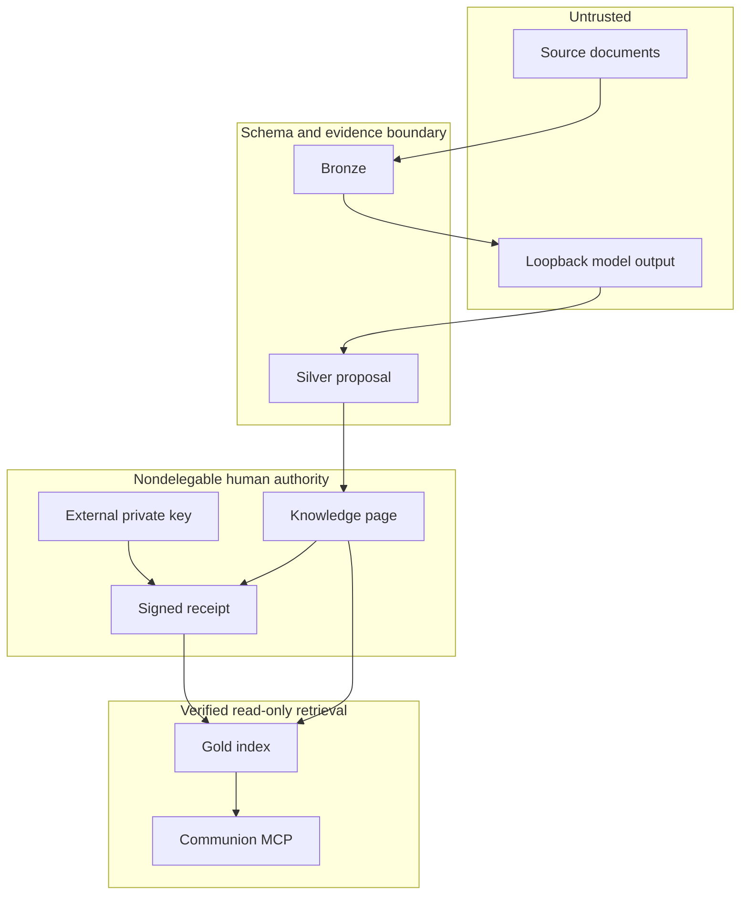

# Ziggurat Architecture

## System purpose

Ziggurat is a memory admission firewall. It preserves untrusted source material,
allows models to stage evidence-backed candidates, and requires a separately
verifiable human capability before content becomes durable communion context.

## Assets

| Asset | Location | Security role |
|---|---|---|
| Inbox source | `inbox/` | Untrusted capture input |
| Bronze record | `bronze/` | Immutable, hash-verified evidence |
| Silver proposal | `.ziggurat/proposals/` | Complete but non-authoritative model candidate |
| Knowledge page | `knowledge/` | Human-authored curated content |
| Trust policy | `config/trust.yaml` | Reviewer public-key trust anchors |
| Authorization receipt | `authorizations/` | Detached signed admission decision |
| Communion index | `.ziggurat/gold-index.json` | Authorized Gold retrieval |
| Review index | `.ziggurat/review-index.json` | Policy-safe Silver plus Gold |
| Evidence index | `.ziggurat/evidence-index.json` | Policy-safe Bronze plus Gold |

## Actors and capabilities

| Actor or process | Read | Write | Cannot do |
|---|---|---|---|
| Untrusted source | none | Inbox input | Authorize persistence |
| `ingest` | Inbox, Bronze hashes | New immutable Bronze | Change existing Bronze, Silver, Gold, or indexes |
| Loopback refine model | Prompt content supplied by host | JSON response only | Access filesystem or tools through Ziggurat |
| `refine` host pathway | Bronze citations, target base | One Silver proposal | Write Bronze, knowledge, receipts, trust, reviewed metadata, or indexes |
| Human reviewer | Bronze, Silver, knowledge | Manual page and external signed receipt | Gain factual certainty from a signature |
| `build` | Corpus, receipts, public keys | Generated indexes | Admit a page without valid authorization |
| General AI client | Communion citations | none | Select review/evidence through shipped MCP |
| Advisory reviewer tooling | Review/evidence data | none | Assert human identity or authorize Gold |
| Trusted operator | Entire local vault | Filesystem and process configuration | Delegated trust is outside Ziggurat's guarantees |

The decisive capability is possession of a trusted Ed25519 private key outside the
vault. Public metadata such as `reviewed_by` is not a capability.

## Trust boundaries

AI is allowed to read across the output side of the human boundary. It is not
allowed to exercise the admission capability.

## State transitions

1. `inbox/*.md` -> `bronze/<kind>/<date>-<slug>.md`
2. Bronze evidence -> `.ziggurat/proposals/<proposal-id>.json`
3. Silver proposal -> manual `knowledge/*.md` plus detached receipt
4. Authorized page -> Gold chunk during `build`
5. Gold chunk -> citation-scoped, read-only communion result

There is no automated Silver-to-knowledge transition and no promote command.
Contradiction proposals remain immutable. A reviewer resolves one by listing its ID
in the page and signing that exact page.

## Enforcement points

| Enforcement point | Control |
|---|---|
| Bronze store | Atomic no-overwrite write and body SHA-256 |
| Proposal contract | Strict v2 schema excludes admission fields |
| Evidence validator | Exact Bronze path, body hash, line range, quote, and quote hash |
| Proposal store | Atomic, root-constrained write; strict fail-closed reads |
| Page canonicalizer | Stable semantic JSON and LF-normalized body |
| Receipt verifier | Trusted Ed25519 key, strict schema, exact page/path/identity/time binding |
| Gold eligibility | Status, retrieval, privacy, sensitivity, egress, age, lineage, contradiction, authorization |
| Profile builders | Physical separation and policy-safe source selection |
| Index verifier | Chunk labels, content, provenance, BM25, trust policy, and live corpus |
| MCP server | Communion-only startup, two read-only tools, session-scoped citations |

## Physical index isolation

- **communion**: authorization-valid Gold only. This is answer-producing AI context.
- **review**: policy-safe canonical Silver proposals plus authorization-valid Gold.
  This is advisory context, not identity proof.
- **evidence**: policy-safe, integrity-valid Bronze plus authorization-valid Gold.
  This is forensic context, not identity proof.

Each index has a profile literal, deterministic chunk IDs, a trust-policy
fingerprint, and a corpus fingerprint over complete chunk integrity. Review and
evidence are not exposed by shipped MCP startup.

## Provenance trust and instruction authority

Bronze hashes prove that cited bytes match captured bytes. An authorization receipt
proves that a configured key approved exact curated content. Neither grants
instruction authority. Every chunk is labeled `content_role: reference` and
`instruction_authority: none`, including Gold.

## Versioning and rollback

Knowledge pages, trust policy, receipts, and proposals are ordinary files intended
for Git versioning. Git supplies human-readable diff, history, and rollback.
Generated indexes are ignored and rebuilt from source artifacts. A Git commit is
valuable audit history, but only a valid detached receipt grants Gold eligibility.
