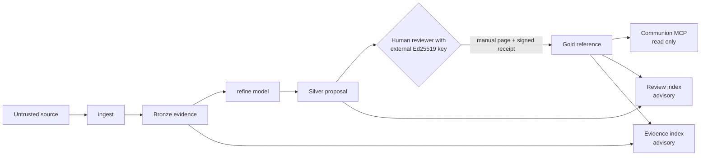

# Ziggurat

**Models propose. Humans decide what persists.**

Ziggurat is a human-gated memory firewall: a local TypeScript reference implementation
that treats durable AI memory as a privileged write surface. An AI can read approved
content and can draft a complete, evidence-backed candidate. It cannot admit that
candidate to durable shared memory. Only a human holding an external Ed25519 private key
can.

## The problem: memory poisoning is a durable write attack

Persistent AI context turns a poisoned document, a fabricated preference, or an embedded
instruction into influence that survives across sessions. One bad write keeps paying out.
Microsoft's
[AI Memory / Context Poisoning](https://learn.microsoft.com/en-us/security/zero-trust/catalog-ai-attack-techniques/ai-memory-context-poisoning)
threat description recommends governing memory writes, provenance, integrity, review,
isolation, versioning, and rollback.

Ziggurat implements those controls with a Medallion pipeline: immutable **Bronze**
evidence, canonical **Silver** proposals, and separately authorized **Gold** reference
data.

## What makes it different

- **The authority boundary is cryptographic, not procedural.** Gold admission requires a
  detached Ed25519 receipt from a key configured in `config/trust.yaml`. A
  `reviewed_by: alice` string is metadata, not authority.
- **No code path can admit content.** There is no signer, apply, approve, or promote
  command, and no `--promote` flag. Key custody lives outside the vault by design.
- **Models write exactly one artifact type.** The refine pathway can only stage strict
  schema-version-2 Silver proposals. It cannot write Bronze, knowledge pages, reviewed
  metadata, trust anchors, receipts, or indexes.
- **Every citation is checked against real bytes.** A fabricated quote, digest, or line
  range fails staging against the Bronze files on disk.
- **Approval is not instruction authority.** Every retrieved chunk, including Gold,
  reports `content_role: reference` and `instruction_authority: none`. Gold means
  authorized reference data, not truth and not a command.



The human layer is a nondelegable authority boundary, not an inaccessible layer. Models
may consume approved output. They cannot exercise the private-key capability that
authorizes persistence.

## Quickstart

Requirements: Node.js 22 or newer. Ziggurat is distributed as source, not as a published
npm package.

Clone this repository, then from the checkout root:

```bash
npm ci
npm run build
npm run check                       # full test suite
node dist/src/cli/main.js --help
```

Create a vault and capture your first evidence record:

```bash
node dist/src/cli/main.js init --root ./my-vault
cp some-note.md ./my-vault/inbox/
node dist/src/cli/main.js ingest --root ./my-vault --file inbox/some-note.md
node dist/src/cli/main.js build --root ./my-vault
```

To watch the full poisoned-memory scenario run against fixture data:

```bash
node scripts/run-garden-walkthrough.mjs
```

The script stops at the human signing boundary by design.

## How the tiers work

| Tier | Written by | Meaning |
|---|---|---|
| **Bronze** | `ingest`, and nothing else | Immutable, body-hash-verified evidence. Hostile text is preserved exactly, because Bronze is evidence rather than memory. |
| **Silver** | `refine`, and nothing else | A strict version-2 proposal under `.ziggurat/proposals/`. Every citation is revalidated against real Bronze bytes, hashes, and line ranges. |
| **Gold** | `build`, and only with a valid receipt | A human-authored page admitted by a detached Ed25519 receipt plus every eligibility check. |

The three generated indexes remain physically separate. `gold-index.json` holds authorized
Gold only and is the sole communion answer context, while `review-index.json` and
`evidence-index.json` are local advisory context that shipped MCP never exposes.

Ziggurat intentionally ships no signer, apply, approve, or promote command. External key
custody is part of the human authority boundary.

## Commands

The table uses the shorter `ziggurat` binary name. From a source checkout, either replace
it with `node dist/src/cli/main.js` or run `npm link` to create a development-only global
link.

| Command | Purpose |
|---|---|
| `ziggurat init --root <vault>` | Create vault directories and an empty trust policy |
| `ziggurat ingest --root <vault> --file <inbox-file>` | Capture immutable Bronze evidence |
| `ziggurat refine --root <vault> --query <request> [--source <bronze-path>]...` | Stage a strict Silver proposal through a loopback model |
| `ziggurat review --root <vault>` | Render human review packets from staged proposals |
| `ziggurat build --root <vault>` | Rebuild all three isolated indexes |
| `ziggurat query --root <vault> --query <text>` | Query authorized Gold communion |
| `ziggurat mcp --root <vault>` | Start the communion-only read-only MCP server |
| `ziggurat eval --root <vault>` | Run built-in conformance cases |
| `ziggurat check --root <repo> [--audit-clean-room]` | Audit a tree you intend to publish for clean-room and key-material violations |

Configure only loopback model endpoints in `config/adapters.yaml`. The VS Code binding in
`.vscode/mcp.json` starts communion without a selectable profile.

## Core guarantees

- `ingest` is the only Bronze writer, and an `ingest` source must resolve to a real
  regular file physically under `inbox/`.
- `refine` can write only strict version-2 artifacts under `.ziggurat/proposals/`, and
  Silver candidates cannot contain status, reviewer, receipt, or admission metadata.
- No shipped function writes knowledge pages, reviewed metadata, trusted reviewer keys, or
  authorization receipts.
- Gold requires a detached Ed25519 receipt binding the reviewer, timestamp, target path,
  and canonical page digest.
- Shipped MCP startup is communion-only and exposes exactly `search_context` and
  `read_context`, bounded to 1024 query characters, 20 results, and 200 session citations.
- Model and embedding endpoints are limited to HTTP loopback addresses. The refine
  adapter never follows redirects, bounds every request with a 30 second timeout, and
  refuses request or response bodies over 1 MiB.

Ziggurat is not an OS sandbox or a multi-tenant authorization service, and a valid
signature proves exact-content approval rather than factual truth. See
[SECURITY.md](SECURITY.md) for the complete threat model and residual risks.

## Project status

Version 0.1 is a pre-release, single-operator reference implementation. The package is
private and source-distributed; do not depend on the `ziggurat` npm package name.
Contracts, index formats, and CLI behavior may change before 1.0. It is not a hosted
service, an OS sandbox, or a substitute for external key custody.

Continuous integration runs the full suite on Linux, macOS, and Windows against Node.js
22 and 24, plus a documentation-site build.

## Documentation

Task-oriented documentation lives in [`site/`](site/) as a standalone Astro Starlight
project covering getting started, concepts, guides, security, CLI and configuration
reference, and project status. Build and read it locally:

```bash
npm run site:dev      # local development server
npm run site:check    # type check, production build, built-output validation
```

The site is not deployed while this repository is private.

Canonical repository specifications:

- [Architecture](ARCHITECTURE.md) - assets, actors, trust boundaries, enforcement points
- [Security and vulnerability reporting](SECURITY.md) - threat model and residual risks
- [Authorization protocol](docs/authorization-protocol.md) - byte-level signing contract
- [Release checklist](docs/release-checklist.md) - publication gates for maintainers
- [Contributing](CONTRIBUTING.md) - development workflow and boundary rules
- [Support](SUPPORT.md) - where to ask questions
- [Code of Conduct](CODE_OF_CONDUCT.md)
- [MIT License](LICENSE)
