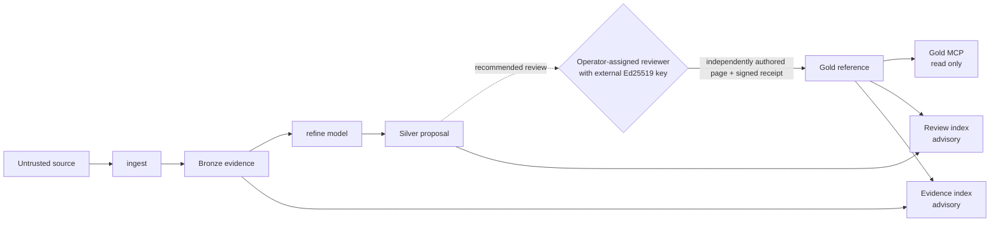

# Ziggurat

**Models propose. Humans decide what persists.**

Ziggurat is a human-gated memory firewall: a local TypeScript reference implementation
that treats durable AI memory as a privileged write surface. An AI can read authorized
content and return a candidate with byte-validated citations. The refine host can persist
that model-originated JSON only as Silver. Gold admission requires a valid receipt from a
configured Ed25519 key; operator policy assigns that key to a reviewer. That receipt's
signature proves key control and exact-content authorization, not humanity, attention,
or review.

## The problem: memory poisoning is a durable write attack

Persistent AI context turns a poisoned document, a fabricated preference, or an embedded
instruction into influence that survives across sessions. One bad write keeps paying out.
Microsoft's
[AI Memory / Context Poisoning](https://learn.microsoft.com/en-us/security/zero-trust/catalog-ai-attack-techniques/ai-memory-context-poisoning)
threat description recommends governing memory writes, provenance, integrity, review,
isolation, versioning, and rollback.

Ziggurat implements those controls with a Medallion pipeline: append-only-through-ingest
**Bronze** evidence, canonical **Silver** proposals, and separately authorized **Gold**
reference data.

## What makes it different

- **The authority boundary is cryptographic, not procedural.** Gold admission requires a
  detached Ed25519 receipt from a key configured in `config/trust.yaml`. A
  `reviewed_by: alice` string is metadata, not authority.
- **Authorization is external to the admission path.** Ziggurat ships no signer,
  apply, approve, or promote command; see the
  [human authority boundary](https://patschmittdev.github.io/Ziggurat/concepts/human-authority-boundary/).
- **The refine host persists one model-originated artifact type.** It can stage only
  strict schema-version-2 Silver JSON. It cannot write Bronze, knowledge pages, reviewed
  metadata, trust anchors, receipts, or indexes.
- **Every citation is checked against stored Bronze text.** A fabricated quote, digest,
  or line range fails staging. Citation integrity does not establish semantic support or
  factual truth; those judgments remain reviewer responsibilities.
- **Approval is not instruction authority.** Every retrieved chunk carries
  `content_role: reference` and `instruction_authority: none`; see
  [provenance and authority](https://patschmittdev.github.io/Ziggurat/concepts/provenance-and-authority/).



The shipped refine and MCP interfaces do not receive the signing capability. An
operator who gives an AI shell, filesystem, or key access has delegated authority
outside the
[boundary](https://patschmittdev.github.io/Ziggurat/concepts/human-authority-boundary/).

### How this differs from other agent-memory systems

Ziggurat requires external authorization where mem0, Letta, and Zep persist memory
automatically; see the [Overview](https://patschmittdev.github.io/Ziggurat/getting-started/overview/#how-it-differs-from-other-agent-memory-systems)
for the comparison and its limits.

## Quickstart

Requirements: Node.js 22 or newer. Ziggurat is distributed as source, not as a published
npm package.

Clone this repository, then from the checkout root:

```bash
npm ci
npm run build
npm run check                       # full test suite
node dist/src/cli/main.js --help
```

Create a vault and capture your first evidence record:

```bash
node dist/src/cli/main.js init --root ./my-vault
cp some-note.md ./my-vault/inbox/
node dist/src/cli/main.js ingest --root ./my-vault --file inbox/some-note.md
node dist/src/cli/main.js build --root ./my-vault
```

To watch the full poisoned-memory scenario run against fixture data:

```bash
node scripts/run-garden-walkthrough.mjs
```

The script prepares a vault, ingests the fixture files, and prints the remaining manual
steps. The full end-to-end boundary is exercised by `test/memory-boundary.test.ts`.

## How the tiers work

| Tier | Written by | Meaning |
|---|---|---|
| **Bronze** | `ingest`, and nothing else | Canonical UTF-8 text after CRLF-to-LF normalization. Ingest uses atomic no-overwrite creation; later body mutation is detectable by SHA-256 verification. |
| **Silver** | Refine host | Model-originated strict version-2 JSON under `.ziggurat/proposals/`. Every citation is revalidated against stored Bronze text, hashes, and line ranges. |
| **Gold** | `build` | Eligible knowledge chunks admitted only with a valid detached Ed25519 receipt and every other eligibility check. |

The three generated indexes remain physically separate. `gold-index.json` holds authorized
Gold only and is the sole answer context, while `review-index.json` and
`evidence-index.json` are local advisory context that shipped MCP never exposes.

## Commands

The table uses the shorter `ziggurat` binary name. From a source checkout, either replace
it with `node dist/src/cli/main.js` or run `npm link` to create a development-only global
link.

| Command | Purpose |
|---|---|
| `ziggurat init --root <vault>` | Create vault directories and an empty trust policy |
| `ziggurat ingest --root <vault> --file <inbox-file>` | Capture no-overwrite, body-hash-verified Bronze evidence |
| `ziggurat refine --root <vault> --query <request> [--source <bronze-path>]...` | Stage a strict Silver proposal through a loopback model |
| `ziggurat review --root <vault>` | Render human review packets from staged proposals |
| `ziggurat build --root <vault>` | Rebuild all three isolated indexes |
| `ziggurat query --root <vault> --query <text>` | Query authorized Gold |
| `ziggurat mcp --root <vault>` | Start the read-only Gold MCP server |
| `ziggurat eval --root <vault>` | Run built-in conformance cases |
| `ziggurat check --root <repo> [--audit-clean-room]` | Audit a tree you intend to publish for clean-room and key-material violations |

Configure only loopback model endpoints in `config/adapters.yaml`. The VS Code binding in
`.vscode/mcp.json` starts the Gold MCP server without a selectable profile.

## Core guarantees

- `ingest` is the only Bronze writer.
- `refine` writes only Silver.
- No shipped path writes knowledge pages, reviewed metadata, trust anchors, or
  receipts.

See [Enforced boundaries](https://patschmittdev.github.io/Ziggurat/security/guarantees/#enforced-boundaries)
for the complete guarantees.

Ziggurat is not an OS sandbox or a multi-tenant authorization service, and a valid
signature proves exact-content approval, not human identity, attention, semantic
support, or factual truth. See
[SECURITY.md](SECURITY.md) for the complete threat model and residual risks.

## Project status

Version 0.1 is a pre-release, single-operator reference implementation. The package is
private and source-distributed; do not depend on the `ziggurat` npm package name.
Contracts, index formats, and CLI behavior may change before 1.0. It is not a hosted
service, an OS sandbox, or a substitute for external key custody.

Continuous integration is configured to run the full suite on Linux, macOS, and Windows
against Node.js 22 and 24, plus a documentation-site build.

## Documentation

Task-oriented documentation lives in [`site/`](site/) as a standalone Astro Starlight
project covering getting started, concepts, guides, security, CLI and configuration
reference, and project status. Build and read it locally:

```bash
cd site
npm ci                # requires Node.js 22.12.0 or newer
npm run dev           # local development server
npm run check         # type check, production build, built-output validation
```

The site is not deployed while this repository is private.

Canonical repository specifications:

- [Architecture](ARCHITECTURE.md) - assets, actors, trust boundaries, enforcement points
- [Security and vulnerability reporting](SECURITY.md) - threat model and residual risks
- [Authorization protocol](docs/authorization-protocol.md) - byte-level signing contract
- [Release checklist](docs/release-checklist.md) - publication gates for maintainers
- [Contributing](CONTRIBUTING.md) - development workflow and boundary rules
- [Support](SUPPORT.md) - where to ask questions
- [Code of Conduct](CODE_OF_CONDUCT.md)
- [MIT License](LICENSE)
