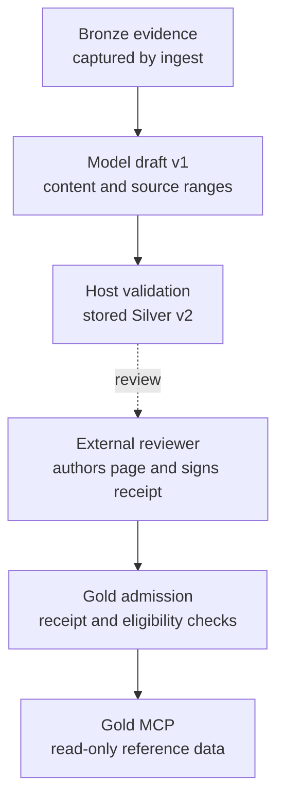

# Ziggurat

**Models propose. Humans decide what persists.**

Ziggurat is a human-gated memory firewall: a local TypeScript reference implementation
that treats durable AI memory as a privileged write surface. An AI can read authorized
content and return a structured draft with source IDs and line ranges. The refine host
derives exact citations and canonical version-2 Silver, then validates and stages only
that Silver artifact. Gold admission requires a valid receipt from a
configured Ed25519 key; operator policy assigns that key to a reviewer. That receipt's
signature proves key control and exact-content authorization, not humanity, attention,
or review.

## Why I built this

I built Ziggurat because I worried about memory and context poisoning of my own data
while autonomous agents research on the open web. The question I kept coming back to
was: how do you prevent the AI from erroneously promoting a Silver proposal to Gold?
The answer here is to remove the door. There is no promote command. A human curates the
Gold layer with a key that no shipped code path holds.

I was also experimenting with aggressive coding-agent velocity. Over long sessions,
I found myself balancing trust in the guardrails I had established against pulling
back when review fatigue started affecting output quality. It felt like a hawk-dove
game: press ahead behind those guardrails, or become more cautious as my capacity
for careful review faded. Related guardrail work is captured in
[Trust Surface Ratchet](https://github.com/patschmittdev/trust-surface-ratchet),
which grew out of my work on Castrum, a private, unpublished project.

That experience motivated a narrower question here: can an agent propose durable
memory without also having the authority to admit it? Ziggurat makes that admission
an explicit, separately authorized step. It does not prove that a person reviewed
carefully, solve review fatigue, or establish better coding output. Pagination and
oldest-first navigation help inspect the backlog, but do not cap accumulation or
guarantee attention to every proposal.

## The problem: memory poisoning is a durable write attack

Persistent AI context turns a poisoned document, a fabricated preference, or an embedded
instruction into influence that survives across sessions. One bad write keeps paying out.
Microsoft's
[AI Memory / Context Poisoning](https://learn.microsoft.com/en-us/security/zero-trust/catalog-ai-attack-techniques/ai-memory-context-poisoning)
threat description recommends governing memory writes, provenance, integrity, review,
isolation, versioning, and rollback.

Ziggurat implements admission and retrieval-integrity controls with a Medallion pipeline: append-only-through-ingest
**Bronze** evidence, canonical **Silver** proposals, and separately authorized **Gold**
reference data. Versioning and rollback depend on operator-managed Git history;
Ziggurat does not supply a Git workflow or sanitize hostile source text.

## What makes it different

- **The authority boundary is cryptographic, not procedural.** Gold admission requires a
  detached Ed25519 receipt from a key configured in `config/trust.yaml`. A
  `reviewed_by: alice` string is metadata, not authority.
- **Authorization is external to the admission path.** Ziggurat ships no signer,
  apply, approve, or promote command; see the
  [human authority boundary](https://github.com/patschmittdev/Ziggurat/blob/main/site/src/content/docs/concepts/human-authority-boundary.md).
- **The refine host persists one model-originated artifact type.** It can stage only
  strict schema-version-2 Silver JSON, materialized from a strict version-1
  `RefinementDraft`. The model never supplies hashes or canonical citation bytes.
  The pathway cannot write Bronze, knowledge pages, reviewed metadata, trust anchors,
  receipts, or indexes.
- **Every citation is checked against stored Bronze text.** The host resolves only
  supplied source IDs and line ranges, derives quotes and digests, and revalidates the
  materialized proposal against live files. Citation integrity does not establish
  semantic support or factual truth; those judgments remain reviewer responsibilities.
- **Approval is not instruction authority.** Every retrieved chunk carries
  `content_role: reference` and `instruction_authority: none`. These labels do not
  enforce how a downstream agent uses the text; see
  [provenance and authority](https://github.com/patschmittdev/Ziggurat/blob/main/site/src/content/docs/concepts/provenance-and-authority.md).



This diagram follows admission. The local review and evidence indexes remain
separate advisory profiles; neither is exposed by shipped MCP.

The shipped refine and MCP interfaces do not receive the signing capability. An
operator who gives an AI shell, filesystem, or key access has delegated authority
outside the
[boundary](https://github.com/patschmittdev/Ziggurat/blob/main/site/src/content/docs/concepts/human-authority-boundary.md).

### How this differs from other agent-memory systems

Ziggurat requires external authorization where mem0, Letta, and Zep persist memory
automatically; see the [Overview](https://github.com/patschmittdev/Ziggurat/blob/main/site/src/content/docs/getting-started/overview.md#how-it-differs-from-other-agent-memory-systems)
for the comparison and its limits.

### Why not signed git commits?

A signed Git commit binds the commit, including its tree, to a signing key. It can
support a human-review policy when signing authority is kept separate from agents.
Commit access alone does not grant signing authority, although a hosting service
can sign changes made through an agent's credentials.

Ziggurat instead uses a page-specific receipt binding the canonical digest, target,
reviewer, timestamp, and key, and revalidates it on every `build` and retrieval.
A Git-based design can enforce similar policies if it verifies trusted reviewer
signatures and live content. If your agents never have write access to the vault
and every merge is reviewed by a person, signed commits plus branch protection may
be enough. Ziggurat is for cases where separating page-level admission from
agent-proposed memory justifies the additional external-signing workflow.

## Quickstart

Requirements: Node.js 22 or newer. Ziggurat is distributed as source, not as a published
npm package.

Clone this repository, then from the checkout root:

```bash
npm ci
npm run build
npm run check                       # full test suite
node dist/src/cli/main.js --help
```

To see the boundary itself, run only the end-to-end poisoning test.
It ingests a poisoned source, shows the unsigned candidate excluded, admits a signed page,
then refuses retrieval once the built Gold index is altered underneath its verification.

```bash
npm run build && node --test dist/test/memory-boundary.test.js
```

Create a vault and capture your first evidence record:

```bash
node dist/src/cli/main.js init --root ./my-vault
cp some-note.md ./my-vault/inbox/
node dist/src/cli/main.js ingest --root ./my-vault --file inbox/some-note.md
node dist/src/cli/main.js build --root ./my-vault
```

To watch the full poisoned-memory scenario run against fixture data:

```bash
node scripts/run-garden-walkthrough.mjs
```

The script prepares a vault, ingests the fixture files, and prints the remaining manual
steps. The full end-to-end boundary is exercised by `test/memory-boundary.test.ts`.

## How the tiers work

| Tier | Written by | Meaning |
|---|---|---|
| **Bronze** | `ingest`, and nothing else | Canonical UTF-8 text after CRLF-to-LF normalization. Ingest uses atomic no-overwrite creation; later body mutation is detectable by SHA-256 verification. |
| **Silver** | Refine host | Strict version-2 JSON materialized from a model's version-1 draft under `.ziggurat/proposals/`. Every citation is revalidated against stored Bronze text, hashes, and line ranges. |
| **Gold** | `build` (index only; the reviewer authors the page) | Eligible knowledge chunks admitted only with a valid detached Ed25519 receipt and every other eligibility check. |

The three generated indexes remain physically separate. `gold-index.json` holds authorized
Gold only and is the sole answer context, while `review-index.json` and
`evidence-index.json` are local advisory context that shipped MCP never exposes.

## Commands

The table uses the shorter `ziggurat` binary name. From a source checkout, either replace
it with `node dist/src/cli/main.js` or run `npm link` to create a development-only global
link.

| Command | Purpose |
|---|---|
| `ziggurat init --root <vault>` | Create vault directories and an empty trust policy |
| `ziggurat ingest --root <vault> --file <inbox-file>` | Capture no-overwrite, body-hash-verified Bronze evidence |
| `ziggurat refine --root <vault> --query <request> [--source <bronze-path>]... [--target knowledge/item.md]` | Materialize and stage strict Silver from a loopback model draft |
| `ziggurat review --root <vault>` | Render human review packets from staged proposals |
| `ziggurat build --root <vault>` | Rebuild all three isolated indexes |
| `ziggurat query --root <vault> --query <text>` | Query authorized Gold |
| `ziggurat mcp --root <vault>` | Start the read-only Gold MCP server |
| `ziggurat eval --root <vault>` | Run built-in conformance cases |
| `ziggurat check --root <repo> [--audit-clean-room]` | Audit a tree you intend to publish for clean-room and key-material violations |

Configure only loopback model endpoints in `config/adapters.yaml`. The VS Code binding in
`.vscode/mcp.json` starts the Gold MCP server without a selectable profile.

The supported refinement protocol is one non-streaming llama.cpp
`POST /v1/chat/completions` request with a Zod-derived JSON Schema response format.
`--target` supplies host-read existing page context and is required for `amend` and
`contradict`. Explicit `--source` remains an operator-authorized privacy disclosure,
not a way to bypass evidence validation. See the canonical
[local model protocol and setup guide](docs/local-model-protocol.md) for the draft/host
contract, pinned setup candidate, and opt-in `npm run eval:model` acceptance gate.
Server checksums, version, planned flags, health, alias, and a nested-schema pilot are
verified. A real end-to-end pilot also captured Bronze, called the model, staged
host-materialized Silver, and rendered review. The first completed 90-attempt batch
failed the staging threshold; human usability remains unscored. A separate revised
batch completed with 90/90 staged, without individual retries or repairs. The full
acceptance gate remains pending human scores. See the
[measured workflow evaluation](docs/model-workflow-evaluation.md) for results and the
revision caveat. Pilot probes do not count toward either batch.

## Core guarantees

- `ingest` is the only Bronze writer.
- `refine` writes only Silver.
- No shipped path writes knowledge pages, reviewed metadata, trust anchors, or
  receipts.

See [Enforced boundaries](https://github.com/patschmittdev/Ziggurat/blob/main/site/src/content/docs/security/guarantees.md#enforced-boundaries)
for the complete guarantees.

Ziggurat is not an OS sandbox or a multi-tenant authorization service, and a valid
signature proves exact-content approval, not human identity, attention, semantic
support, or factual truth. See
[SECURITY.md](SECURITY.md) for the complete threat model and residual risks.

## Project status

Version 0.1 is a pre-release, single-operator reference implementation. The package is
private and source-distributed; do not depend on the `ziggurat` npm package name.
Contracts, index formats, and CLI behavior may change before 1.0. It is not a hosted
service, an OS sandbox, or a substitute for external key custody.

Continuous integration is configured to run the full suite on Linux, macOS, and Windows
against Node.js 22 and 24, plus a documentation-site build.
See the [dated release evidence](docs/release-checklist.md) for the tested `main`
commit and remaining publication gates. A passing CI run is not launch approval.

## Documentation

Task-oriented documentation lives in [`site/`](site/) as a standalone Astro Starlight
project covering getting started, concepts, guides, security, CLI and configuration
reference, and project status. Build and read it locally:

```bash
cd site
npm ci                # requires Node.js 22.12.0 or newer
npm run dev           # local development server
npm run check         # type check, production build, built-output validation
```

The documentation site is live at <https://patschmittdev.github.io/Ziggurat/>.
You can also use the local commands above or browse the
[documentation source](site/src/content/docs/). Source and documentation are public;
no tag or GitHub prerelease has been published.

**Additional local-only gate:** From `site/`, run `npx playwright install chromium` once, then `npm run visual` for visual and accessibility checks; screenshots land in `site/.artifacts/`. CI is active, but this visual gate is not part of either package's `npm run check` or the CI workflow.

Canonical repository specifications:

- [Architecture](ARCHITECTURE.md) - assets, actors, trust boundaries, enforcement points
- [Security and vulnerability reporting](SECURITY.md) - threat model and residual risks
- [Authorization protocol](docs/authorization-protocol.md) - byte-level signing contract
- [External signing interoperability](docs/external-signing-interop.md) - independently tested byte/signature handoff without a shipped signer
- [CLI review workflow](docs/review-workflow.md) - safe diffs, stale warnings, and backlog navigation
- [Policy enforcement](docs/policy-enforcement.md) - authoritative decisions and structured rejection reasons
- [Retrieval evaluation](docs/retrieval-evaluation.md) - measured lexical relevance and known limitations
- [Operating envelope](docs/operating-envelope.md) - measured capacity, revocation, and local recovery
- [Local model protocol](docs/local-model-protocol.md) - draft contract, llama.cpp setup, and model evaluation
- [Release checklist](docs/release-checklist.md) - publication gates for maintainers
- [Contributing](CONTRIBUTING.md) - development workflow and boundary rules
- [Support](SUPPORT.md) - where to ask questions
- [Code of Conduct](CODE_OF_CONDUCT.md)
- [MIT License](LICENSE)
