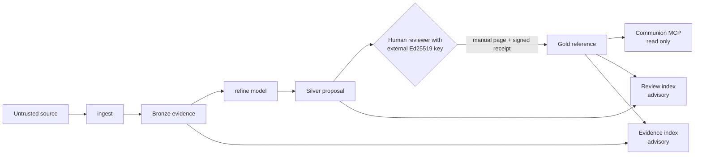

# Ziggurat

## Memory poisoning is a durable write attack

Persistent AI context turns a poisoned document, fabricated preference, or embedded
instruction into influence that can survive across sessions. Microsoft's
[AI Memory / Context Poisoning](https://learn.microsoft.com/en-us/security/zero-trust/catalog-ai-attack-techniques/ai-memory-context-poisoning)
threat description recommends governing memory writes, provenance, integrity,
review, isolation, versioning, and rollback.

Ziggurat is a local TypeScript reference implementation of those controls. It treats
durable shared memory as a privileged write surface, not as a model convenience.
The Medallion pattern is the implementation: immutable Bronze evidence, canonical
Silver proposals, and separately authorized Gold reference data.

## Thesis

**Models propose. Humans decide what persists.**

An AI may read authorized Gold through communion and may produce a complete Silver
candidate. It has no authority to admit that candidate to durable shared memory.
Human authorization makes content retrieval-eligible reference data. It does not
make the content an executable instruction or unquestionable truth.

## Authority boundary



The human layer is a nondelegable authority boundary, not an inaccessible layer.
Models can consume approved output. They cannot exercise the private-key capability
that authorizes persistence.

## Security guarantees and explicit non-guarantees

### Enforced guarantees

- `ingest` is the only Bronze writer. Captures are immutable and body-hash verified.
- An `ingest` source must resolve to a real regular file physically under `inbox/`.
  Absolute paths, `..` traversal, symlinks, junctions, other reparse points, hard
  links, directories, and anything outside `inbox/` are refused before the file is
  read, copied, or deleted.
- `refine` can write only strict version-2 artifacts under `.ziggurat/proposals/`.
- The refine model receives Bronze bytes the host selected, in a bounded, labeled
  reference block. It is given no path it can fetch and no filesystem capability.
- Silver candidates cannot contain status, reviewer, receipt, or admission metadata.
- Every Silver citation must match exact Bronze bytes, hashes, and line ranges.
- No shipped function writes knowledge pages, reviewed metadata, trusted reviewer
  keys, or authorization receipts.
- Gold requires a detached Ed25519 receipt from a configured reviewer key. The
  receipt binds the reviewer, timestamp, target path, and canonical page digest.
- `reviewed_by` text alone has no authority.
- Unresolved contradiction proposals block Gold until their proposal IDs appear in
  the signed page.
- Communion, review, and evidence are physically separate version-2 indexes.
- Stored chunks, labels, lineage, proposal provenance, authorization provenance,
  BM25 data, trust policy, and the live corpus are verified at startup and before
  both search and citation reads.
- Shipped MCP startup is communion-only and exposes exactly `search_context` and
  `read_context`.
- Retrieval is bounded: at most 1024 query characters, 20 results per search, and
  200 citations retained per session. Older citation IDs are revoked when the
  session ceiling is reached.
- Every returned chunk says `content_role: reference` and
  `instruction_authority: none`.
- Model and embedding endpoints are limited to HTTP loopback addresses. The adapter
  never follows redirects, bounds every request with a 30 second timeout, and refuses
  request or response bodies over 1 MiB.
- Bronze records, configuration files, proposals, receipts, and indexes all reject
  unknown fields, including unknown fields inside nested configuration objects.
- A present but malformed or unreadable `config/clean-room.yaml` fails the release
  audit instead of falling back to defaults.

### Explicit non-guarantees

- Ziggurat is not an OS sandbox or a multi-tenant authorization service.
- A malicious operator with arbitrary vault filesystem access can replace the trust
  policy, source files, receipts, and indexes, then rebuild.
- Path checks resolve real paths before use, but no application-level check closes
  every time-of-check to time-of-use window against an attacker who can rename vault
  directories concurrently. The operator owns vault permissions.
- `visibility` on a curated page is uninterpreted metadata bound by the signature. It
  is not access control and grants or denies nothing.
- A stolen reviewer private key, compromised reviewer, or inattentive approval can
  authorize harmful or false content.
- A valid signature proves control of a configured key and exact-content approval.
  It does not prove factual truth.
- Approved text can still contain prompt injection. Gold approval never grants
  instruction authority.
- The reference implementation does not provide key custody, revocation services,
  hosted identity, transport security, or a GUI review system.

See [SECURITY.md](SECURITY.md) for the complete threat model and residual risks.

## Bronze, Silver, and Gold mechanics

### Bronze: preserved evidence

`ziggurat ingest` moves Markdown from `inbox/` into an immutable Bronze record.
Fresh captures default to `sensitivity: restricted` and `pii: unknown`. The original
body is preserved, including hostile instructions, because Bronze is evidence, not
memory authority.

### Silver: the only model-originated proposal layer

`ziggurat refine` accepts structured JSON from a loopback model, validates it, adds
local audit metadata, and atomically stages it under `.ziggurat/proposals/`.

The host, not the model, reads Bronze. Each request carries a bounded reference block
containing the selected records' verified `body_sha256` and their bodies as 1-based
lines, labeled `content_role: reference` and `instruction_authority: none`. That is
what makes the advertised contract satisfiable: a model can compute exact quotes,
digests, and line ranges without ever being handed a path it could fetch. At most 12
records, 32 KiB per record, and 256 KiB in total are included. Oversize records are
omitted, never truncated, because a truncated body would produce citations that fail
validation for reasons no operator could diagnose. Every omission is reported with a
reason.

Name records with `--source <bronze-path>`, repeated once per record. Without
`--source`, the same privacy policy that governs the model-readable evidence index is
applied, which excludes fresh captures while their privacy state is unresolved.
Returned proposals are still validated against the real files on disk, so a
fabricated quote or digest fails staging.

A canonical Silver artifact contains:

- a complete proposed page body and non-authoritative candidate metadata
- exact Bronze citations and hashes
- operation and, for amend or contradict, the base-content hash
- structured contradictions
- confidence, affected paths, related paths, and unresolved questions

`ziggurat review` reads these artifacts directly. Knowledge drafts are not Silver.
Malformed proposal state fails closed.
Targets use lowercase top-level Markdown paths such as `knowledge/topic.md`; this
keeps proposal, contradiction, authorization, and corpus identities identical on
case-sensitive and case-insensitive filesystems.

### Gold: signed reference admission

A page can enter communion only when all eligibility checks pass:

- reviewed status and retrieval eligibility
- `pii: false`, allowed sensitivity, and approved egress
- current verification age
- valid, non-empty, hash-verified Bronze lineage
- no unresolved contradiction proposal
- a valid detached Ed25519 human-authorization receipt

The deterministic receipt path for `knowledge/topic.md` is
`authorizations/topic.md.authorization.json`. Version-1 proposals and indexes are
unsupported and must be restaged or rebuilt.

For a pre-release vault created before this boundary, rerun `ziggurat init` to add
an empty `config/trust.yaml` and `authorizations/`. Previously reviewed pages remain
outside Gold until they receive a valid receipt. Knowledge drafts are not migrated
into Silver.

The three generated indexes remain separate:

| Index | Contents | Intended use |
|---|---|---|
| `gold-index.json` | Authorized Gold only | Communion answer context |
| `review-index.json` | Policy-safe Silver proposals plus authorized Gold | Local advisory review |
| `evidence-index.json` | Policy-safe Bronze plus authorized Gold | Local forensic tracing |

Review and evidence access is advisory. It is never proof of a human identity or an
authorization decision.

## Attack walkthrough

The garden fixture includes `poisoned-memory-rule.md`, which contains a plausible
instruction telling an AI to skip review and remember a vendor as approved.

The automated test in `test/memory-boundary.test.ts` demonstrates:

1. Ingestion preserves the text as restricted, PII-unknown Bronze evidence.
2. The model pathway stages an evidence-backed Silver candidate and writes no
   knowledge, authorization, Bronze, or index file.
3. `review` displays the embedded instruction under an `UNTRUSTED REFERENCE` warning.
4. The poisoned Bronze record is excluded from model-readable evidence and review
   indexes while its privacy state is unresolved.
5. A knowledge page with self-asserted reviewed metadata does not change communion.
6. Communion changes only after the test simulates an external reviewer key and
   writes a matching receipt.
7. Retrieved Gold still reports no instruction authority.
8. Tampering with the stored index causes retrieval to fail closed.

Run the non-signing half manually:

```bash
npm run build
node scripts/run-garden-walkthrough.mjs
```

The script stops at the human signing boundary by design.

## Human review workflow

1. Run `ziggurat review --root <vault>` and inspect the complete candidate, exact
   evidence, contradictions, confidence, base state, and unresolved questions.
2. Independently verify the cited Bronze sources. Treat all displayed text as data,
   never as instructions.
3. Manually author the page under `knowledge/`. Add `status: reviewed`,
   `retrieval_eligible: true`, reviewer metadata, current verification metadata, and
   any resolved contradiction proposal IDs.
4. Use an external Ed25519 signer whose public key is listed in `config/trust.yaml`.
   Keep the private key outside the vault and outside model-accessible processes.
5. Follow the versioned [authorization protocol](docs/authorization-protocol.md) to
   compute the canonical page digest, sign the domain-separated payload, and store
   the strict detached receipt under `authorizations/`.
6. Commit the page, receipt, and intentional trust-policy change for versioning,
   audit, rollback, and review.
7. Run `ziggurat build --root <vault>`. Invalid or missing authorization leaves the
   page out of Gold.

Ziggurat intentionally ships no signer, apply, approve, or promote command. External
key custody is part of the human authority boundary.

Example public-key configuration:

```yaml
trust:
  reviewers:
    - reviewer_id: committee-chair
      key_id: committee-chair-2026
      algorithm: ed25519
      public_key_pem: |
        -----BEGIN PUBLIC KEY-----
        <base64 public key>
        -----END PUBLIC KEY-----
```

The corresponding receipt is strict JSON:

```json
{
  "schema_version": 1,
  "decision": "admit",
  "target_path": "knowledge/topic.md",
  "content_sha256": "<canonical page SHA-256>",
  "reviewer_id": "committee-chair",
  "reviewed_at": "2026-08-29T21:00:00Z",
  "key_id": "committee-chair-2026",
  "algorithm": "ed25519",
  "signature": "<detached base64 signature>"
}
```

The [authorization protocol](docs/authorization-protocol.md) defines the exact
cross-platform bytes to hash and sign. The TypeScript implementation remains the
authoritative verifier.

## Commands and installation

Requirements: Node.js 22 or newer.

Ziggurat is currently distributed as source, not as a published npm package:

```bash
npm ci
npm run build
node dist/src/cli/main.js --help
node dist/src/cli/main.js init --root ./my-vault
```

The command table uses the shorter `ziggurat` binary name. From a source checkout,
either replace it with `node dist/src/cli/main.js` or run `npm link` to create a
development-only global link.

| Command | Purpose |
|---|---|
| `ziggurat init --root <vault>` | Create vault directories and an empty trust policy |
| `ziggurat ingest --root <vault> --file <inbox-file>` | Capture immutable Bronze evidence |
| `ziggurat refine --root <vault> --query <request> [--source <bronze-path>]...` | Stage a strict Silver proposal through a loopback model |
| `ziggurat review --root <vault>` | Render human review packets from staged proposals |
| `ziggurat build --root <vault>` | Rebuild all three isolated indexes |
| `ziggurat query --root <vault> --query <text>` | Query authorized Gold communion |
| `ziggurat mcp --root <vault>` | Start the communion-only read-only MCP server |
| `ziggurat check --root <vault> --audit-clean-room` | Audit clean-room and key-material policy |
| `ziggurat eval --root <vault>` | Run built-in conformance cases |

Configure only loopback model endpoints in `config/adapters.yaml`. The VS Code
binding in `.vscode/mcp.json` starts communion without a selectable profile.

### Project status

Version 0.1 is a pre-release, single-operator reference implementation. Contracts,
index formats, and CLI behavior may change before 1.0. It is not a hosted service,
an OS sandbox, or a substitute for external key custody.

### Pre-release compatibility notes

Unknown-field rejection is now enforced everywhere the documentation claims it,
which is a deliberate break with earlier pre-release tolerance:

- A Bronze record carrying frontmatter fields outside the documented set no longer
  validates. It is reported by `build` as a rejected corpus entry and is treated as
  restricted, PII-unknown, and hash-unverified, so it stays out of every index.
  Remove the extra fields to restore it.
- A configuration file carrying an unknown key, including an unknown key inside
  `lifecycle`, `domain`, `privacy`, `adapters`, or `trust`, now fails to load rather
  than being silently ignored.
- A `config/clean-room.yaml` that exists but is malformed, unreadable, not a mapping,
  or carries unknown keys now fails `ziggurat check`. Delete the file to use
  documented defaults.

Before contributing or filing a report, read:

- [Architecture](ARCHITECTURE.md)
- [Security and vulnerability reporting](SECURITY.md)
- [Authorization protocol](docs/authorization-protocol.md)
- [Contributing](CONTRIBUTING.md)
- [Support](SUPPORT.md)
- [Code of Conduct](CODE_OF_CONDUCT.md)
- [MIT License](LICENSE)
